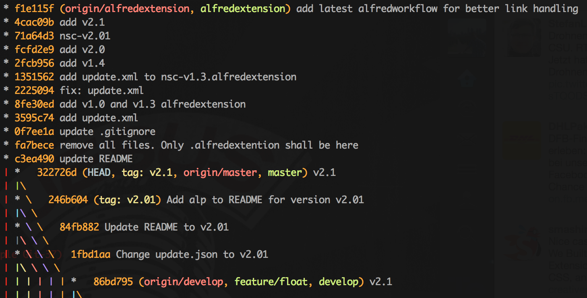

# gitCS

gitCS is my cheat sheet repo. There are so many nice git commands, scripts and tweaks out there to improve your git experience. But I cannot remember all of them so I will collect them here.

If you know a nice git command or maybe you have a good script feel free to send a pull request.

---
ToC
---
#### git aliases
* [pretty oneline log](#pretty-oneline-log)
* [reset file](#reset-file)
* [show last 10 branches](#show-last-10-branches)
* [create empty branch](#create-empty-branch)
* [git today](#git-today)
* [git dad](#git-dad)

#### one liner (cmd)
* [count lines of all files in git repo](#count-lines-of-all-files-in-git-repo)
* [git branch-cleanup](#git-branch-cleanup)

#### scripts
* [git-loglive](#git-loglive)
* [git-graphlive](#git-loglive)
* [generaterandomchanges](#generaterandomchanges)

---
## git aliases

### pretty oneline log

	git log --all --color --graph --pretty=format:'%Cred%h%Creset \
		-%C(yellow)%d%Creset %s %Cgreen(%cr) %C(bold blue)<%an>%Creset' \
		--abbrev-commit



**Show staged diff**

`git diff --staged`

### reset file
#### reset to latest commit
`git checkout -- <file>`

#### reset file to state 2 commits ago
`git checkout HEAD^ -- <file>` (or replace `HEAD^` with any other commit syntax like an explicit SHA1).

### show last 10 branches
quickly see the last 10 branches you've worked on (especially helpful when jumping back and forth between branches).

	git for-each-ref --sort=-committerdate --count=10 \
		--format='%(refname:short)' refs/heads/

### create empty branch
Normally branches share files from the directory, but in Git it is possible to create empty branches.

You can create a new empty branch like this:
`git checkout --orphan NEWBRANCH`

Since you want to create a new empty branch that has nothing to do with the original branch, you can delete all files in the new working directory:
`git rm -rf .`

### git today
Quickly see what you've done today

`git config --global alias.today "log --since=midnight --author='$(git config user.name)' --oneline"`

### git dad
(Found on [r/git](https://www.reddit.com/r/git/comments/6ecr4o/git_dad/) by [kannonboy](https://www.reddit.com/user/kannonboy))

    $ git config --global alias.dad '!curl https://icanhazdadjoke.com/ && git add'
    $ git dad .
    I used to hate facial hair, but then it grew on me.

Since git's aliasing system passes any parameter on to the underlying command, your `git add` operation completes normally _and_ you get a bonus dad joke.    
    

## one liner (cmd)

### count lines of all files in git repo

* outputs the total number of loc
	* `git ls-files | xargs cat | wc -l`
* outputs loc for each file & sum
	* `git ls-files | xargs wc -l`

### git branch-cleanup

Do you find yourself staring at a mess when you type git branch. Cleanup after yourself with ease with this git alias.

git branch-cleanup Will delete any local branches that have already been merged as well as prune remote branches that have been deleted from your origin repo.

    git branch --merged | grep -v master | xargs git branch -d && git remote prune origin

## scripts

all scripts can be found in the `scripts` folder

### git-loglive
Shows and updates the git log live.

```sh
#!/bin/bash
 
while :
do
    clear
    git --no-pager log --graph --pretty=format:'%Cred%h%Creset -%C(yellow)%d%Creset %s %Cgreen(%ci) %C(bold blue)<%an>%Creset' --abbrev-commit --date=relative --all
    sleep 1
done
```

### git-graphlive

Similar script like git-loglive

```sh
#!/bin/bash

while :
do
    clear
    git --no-pager log -$1 --graph --all --pretty=format:'%Cred%h%Creset -%C(yellow)%d%Creset %s' --abbrev-commit --date=relative
    sleep 2
done
```

### generaterandomchanges

Will generate random files and commit them. Good for seminars and workshops.

Usage: `generaterandomchanges <filecount> <filenamebase> <filenameextension>`

```sh
#!/bin/bash
 
#Ensure we have the quantity specified on the CLI
if [ -z "$3" ]; then ARG_ERR=ERR; fi
if [ -z "$2" ]; then ARG_ERR=ERR; fi
if [ -z "$1" ]; then ARG_ERR=ERR; fi
if [ -n "$ARG_ERR" ];
then
    echo "Usage: <filecount> <filenamebase> <filenameextension>"
    exit
fi
 
count=$1
filenamebase=$2
filenameextension=$3
for (( filenumber = 1; filenumber <= $count ; filenumber++ )); do
    echo "Some new random text: $RANDOM" >> $filenamebase$filenumber.$filenameextension
    git add $filenamebase$filenumber.$filenameextension
    git commit -m"A random change of $RANDOM to $filenamebase$filenumber.$filenameextension"
done
```
### stats for your git repo

```sh
IFS=''
for author in $(git log --all --format="%an" | sort -u)
do
  git log --author="$author" --pretty=tformat: --numstat | \
  grep -v node_modules |  \
  awk '{ add += $1 ; subs += $2 ; loc += $1 - $2 } END \
  { printf "%s +++ / %s --- / %s ++- \n",add,subs,loc }' -
done
```
Will ouput something like this: `135 +++ / 14 --- / 121 ++-`

---
### Sources

* [@tlberglund](https://github.com/tlberglund) → [git-loglive](https://gist.github.com/tlberglund/3714970)
* [@matthewmccullough](https://github.com/matthewmccullough) → [generaterandomchanges](https://github.com/matthewmccullough/scripts/blob/master/generaterandomchanges)
* [Sebastian Schuberth](https://plus.google.com/u/0/107276674876700831183)
* [Robin Curry](https://github.com/robincurry) → [git branch-cleanup](https://coderwall.com/p/buo9nq)
* [Roberto Bonvallet](https://github.com/rbonvall) → [git today](https://coderwall.com/p/7jbwww?utm_campaign=weekly_digest&utm_content=Tell+us+about+your&utm_medium=email)
