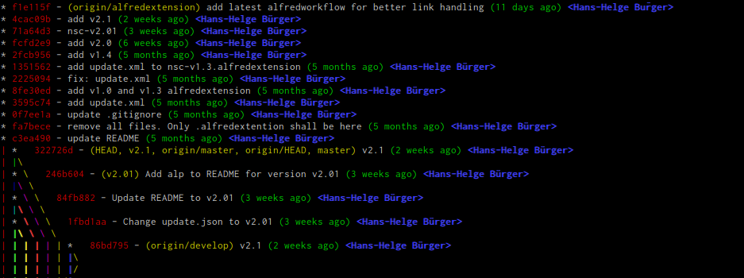

# gitCS

gitCS is my cheat sheet repo. There are so many nice git commands, scripts and tweaks out there to improve your git experience. But I cannot remember all of them so I will collect them here.

If you know a nice git command or maybe you have a good script feel free to send a pull request.

---
## git aliases

**pretty online log**

`git log --all --decorate --abbrev-commit --oneline --graph`

## one liner (cmd)

**count lines of all files in git repo**

* outputs the total number of loc
	* `git ls-files | xargs cat | wc -l`
* outputs loc for each file & sum
	* `git ls-files | xargs wc -l`

## scripts

all scripts can be found in the `scripts` folder

### git-loglive
Shows and updates the git log live.

	#!/bin/bash
 
	while :
	do
    	clear
    	git --no-pager log --graph --pretty=format:'%Cred%h%Creset -%C(yellow)%d%Creset %s %Cgreen(%ci) %C(bold blue)<%an>%Creset' --abbrev-commit --date=relative --all
    	sleep 1
	done

---
### Sources

* [@tlberglund](https://github.com/tlberglund) → [https://gist.github.com/tlberglund/3714970](https://gist.github.com/tlberglund/3714970)